# HF-Lennard Workflow System - Dataflow Diagram

## System Components Overview


## Complete Workflow Sequence Diagram - Phase 1 (Pre-Approval)


    
## User Interaction & Improvement Loop

```mermaid
sequenceDiagram
    participant USER as User
    participant TG as Telegram Bot  
    participant WS as Workflow Server
    participant LS as Letter Service
    participant PS as PDF Service
    participant AQ as Approval Queue

    Note over USER,AQ: USER REVIEW & IMPROVEMENT LOOP
    
    loop Until Approved or Rejected
        USER->>TG: Review letter
        
        alt User requests improvement
            USER->>TG: "✏️ Improve" + feedback
            TG->>WS: ImproveApproval(gRPC)
            Note right of TG: {<br/>  approval_id: "UUID",<br/>  feedback: "Make it shorter..."<br/>}
            
            WS->>AQ: Load ApprovalData
            AQ-->>WS: Current approval state
            
            WS->>LS: GenerateImprovedLetter(gRPC)
            Note right of WS: Send:<br/>- Original letter<br/>- Feedback<br/>- Dossier data
            
            LS-->>WS: Improved letter
            
            WS->>AQ: Update ApprovalData
            Note right of WS: - Add to letter_history<br/>- Update current_letter<br/>- Increment iteration
            
            WS->>PS: Generate new PDF
            PS-->>WS: Updated PDF
            
            WS->>TG: Send improved version
            TG->>USER: Display new letter
            
        else User approves
            USER->>TG: "✅ Approve"
            TG->>WS: ApproveWorkflow(gRPC)
            Note right of TG: {<br/>  approval_id: "UUID",<br/>  approved_by: user_id<br/>}
            
            WS->>AQ: Update state
            Note right of WS: state = "Approved"
            
            Note over WS,AQ: CONTINUE TO PHASE 2
            
        else User rejects
            USER->>TG: "❌ Reject"
            TG->>WS: RejectWorkflow(gRPC)
            
            WS->>AQ: Update state
            Note right of WS: state = "Rejected"
            
            Note over WS,AQ: WORKFLOW ENDS
        end
    end
```



## Complete Workflow Sequence Diagram - Phase 2 (Post-Approval)

```mermaid
sequenceDiagram
    participant WS as Workflow Server
    participant AQ as Approval Queue
    participant PS as PDF Service
    participant LX as LetterXpress
    participant ZH as Zoho CRM
    participant TG as Telegram Bot

    Note over WS,TG: PHASE 2: CONTINUE AFTER APPROVAL
    
    Note over WS,TG: Called via continue_after_approval()
    
    WS->>AQ: Load ApprovalData
    Note right of WS: Get approved letter,<br/>address, and PDF
    
    AQ-->>WS: Complete approval data
    Note left of AQ: Contains:<br/>- Approved letter<br/>- Mailing address<br/>- PDF (base64)
    
    Note over WS,TG: STEP 7: SEND LETTER
    
    WS->>PS: POST /generate-pdf
    Note right of WS: Regenerate final PDF<br/>(could optimize to reuse)
    
    PS-->>WS: Final PDF
    
    WS->>LX: POST /api/v2/letters
    Note right of WS: {<br/>  pdf: base64(pdf_content),<br/>  recipient: {<br/>    name: "Max Mustermann",<br/>    company: "Tech GmbH",<br/>    address: {...}<br/>  },<br/>  options: {<br/>    color: true,<br/>    duplex: false,<br/>    envelope: "C4_WITH_WINDOW"<br/>  }<br/>}
    
    LX-->>WS: Tracking Info
    Note left of LX: {<br/>  letter_id: "LX-789012",<br/>  status: "queued",<br/>  tracking_url: "..."<br/>}
    
    Note over WS,TG: STEP 8: COMPLETION & CLEANUP
    
    WS->>ZH: POST /attachments
    Note right of WS: Attach PDF to task<br/>filename: "Brief_{contact_id}.pdf"
    
    WS->>ZH: PATCH /records/Tasks/{id}
    Note right of WS: {<br/>  status: "Abgeschlossen",<br/>  notes: "Brief erfolgreich versendet.<br/>Tracking: LX-789012"<br/>}
    
    ZH-->>WS: Updates confirmed
    
    WS->>TG: SendCompletionNotification()
    Note right of WS: "✅ Workflow completed!<br/>Letter sent to Max Mustermann<br/>Tracking: LX-789012"
    
    WS->>AQ: Archive approval
    Note right of WS: Move to processed/<br/>with timestamp
```



## Message Types and Payloads

### 1. Telegram → Workflow Server
**Message**: `TriggerWorkflow` (gRPC)
```protobuf
message WorkflowTrigger {
    string trigger_id = 1;      // UUID for this trigger
    int32 max_tasks = 2;         // Number of tasks to process
    string trigger_source = 3;   // "telegram" or "api"
    bool processed = 4;
    string result = 5;
    Timestamp processed_at = 6;
}
```

### 2. Workflow Server → Zoho CRM
**Message**: REST API calls via Nango proxy

```json
// GET /records/Tasks?status=Offen&limit={max_tasks}
Response: [{
    "id": "1294764000002275045",
    "Subject": "Send letter to contact",
    "Who_Id": {
        "id": "1294764000001716090",
        "name": "Max Mustermann"
    },
    "What_Id": {
        "id": "1294764000001234567",
        "name": "Tech GmbH"
    },
    "Status": "Offen"
}]

// GET /records/Contacts/{who_id}
Response: {
    "id": "1294764000001716090",
    "Full_Name": "Max Mustermann",
    "Email": "max@tech.de",
    "LinkedIn_ID": "max-mustermann-123",
    "Mailing_Street": null,
    "Mailing_City": null
}
```

### 3. Workflow Server → Dossier Service
**Message**: `ExtractDossier` (gRPC)
```protobuf
message DossierRequest {
    string contact_id = 1;      // Zoho contact ID
    string person_name = 2;
    string company_name = 3;
    string linkedin_url = 4;
}

message DossierResponse {
    string contact_id = 1;
    DossierBundle debug_format = 2;  // Contains embedded data
}

message DossierBundle {
    PersonDossier person_dossier = 1;
    CompanyDossier company_dossier = 2;
    string generated_at = 3;
}

message PersonDossier {
    string content = 1;         // Markdown formatted text
    string full_name = 2;
    string current_title = 3;
    repeated string skills = 4;
    DossierMetadata metadata = 5;
}

message CompanyDossier {
    string content = 1;         // Markdown formatted text
    string company_name = 2;
    ExtractedAddress mailing_address = 3;
    bool address_found = 4;
    ContactInfo contact_info = 5;
    DossierMetadata metadata = 6;
}
```

### 4. Workflow Server → Letter Service
**Message**: `GenerateLetter` (gRPC)
```protobuf
message LetterGenerationRequest {
    string person_info = 1;      // Markdown from person dossier
    string company_info = 2;     // Markdown from company dossier
    MailingAddress mailing_address = 3;
    string task_context = 4;     // Task subject/description
    string language = 5;         // "de" or "en"
}

message LetterGenerationResponse {
    Letter letter = 1;
}

message Letter {
    string subject = 1;
    string greeting = 2;
    string body = 3;
    string sender_name = 4;
    string recipient_name = 5;
    string company_name = 6;
}
```

### 5. Workflow Server → PDF Service
**Message**: HTTP POST `/generate-pdf`
```json
{
    "template_path": "templates/letter_template.odt",
    "data": {
        "recipient": {
            "name": "Max Mustermann",
            "company": "Tech GmbH",
            "position": "CEO"
        },
        "sender": {
            "name": "HF Lennard",
            "title": "Business Development"
        },
        "content": {
            "salutation": "Sehr geehrter Herr Mustermann",
            "body_paragraphs": ["..."],
            "closing": "Mit freundlichen Grüßen"
        },
        "metadata": {
            "date": "11. September 2025",
            "reference": "T-123456"
        }
    }
}
```

### 6. Workflow Server → Telegram
**Message**: Approval Request via Telegram Bot API
```json
{
    "chat_id": "-1001234567890",
    "text": "📋 Approval Request\n\nRecipient: Max Mustermann\nCompany: Tech GmbH\n\nSubject: IT-Lösungen für moderne Prozesse",
    "parse_mode": "Markdown",
    "reply_markup": {
        "inline_keyboard": [
            [
                {"text": "✅ Approve", "callback_data": "approve:{approval_id}"},
                {"text": "❌ Reject", "callback_data": "reject:{approval_id}"}
            ],
            [
                {"text": "✏️ Improve", "callback_data": "improve:{approval_id}"}
            ]
        ]
    }
}

// Separate message with PDF attachment
{
    "chat_id": "-1001234567890",
    "document": {
        "file_content": "[PDF binary data]",
        "filename": "Brief_Max_Mustermann.pdf"
    },
    "caption": "Letter preview (iteration 1)"
}
```

### 7. Workflow Server → LetterXpress
**Message**: POST `/api/v2/letters`
```json
{
    "auth": {
        "username": "api_user",
        "api_key": "xxx"
    },
    "letter": {
        "pdf": "base64_encoded_pdf_content",
        "recipient": {
            "name": "Max Mustermann",
            "company": "Tech GmbH",
            "street": "Techstr. 1",
            "zip": "10115",
            "city": "Berlin",
            "country": "DE"
        },
        "options": {
            "color": true,
            "duplex": false,
            "envelope_type": "C4_WINDOW",
            "postage_type": "standard"
        }
    }
}
```

## Error Handling Flow


## Service Health Monitoring


## Data Persistence

```
docker/volumes/
├── workflow-data/
│   ├── approvals/          # Active approval queue
│   │   ├── pending/        # Awaiting user response
│   │   │   └── {approval_id}.json  # Complete ApprovalData
│   │   └── processed/      # Completed approvals
│   │       └── approval_{id}_processed_{timestamp}.json
│   ├── triggers/           # Incoming workflow requests (unused)
│   ├── processed/          # Archived workflows
│   └── data/
│       ├── attachments/    # File attachments
│       ├── dossiers/       # Empty - dossiers embedded in approvals
│       ├── letters/        # Empty - letters embedded in approvals
│       └── pdfs/          # Generated PDFs
│           └── {approval_id}.pdf
└── logs/
    └── grpc/              # gRPC request/response logs
        └── dossier/       # Dossier service logs only
            ├── {timestamp}_{contact_id}_request.json
            └── {timestamp}_{contact_id}_response.json
```

### ApprovalData Structure (Embedded Storage)
All workflow data is embedded in a single ApprovalData JSON file:
```json
{
  "approval_id": "UUID",
  "task_id": "Zoho task ID",
  "contact_id": "Zoho contact ID", 
  "state": "PendingApproval|NeedsImprovement|Approved|Rejected",
  "current_letter": {
    "subject": "...",
    "greeting": "...",
    "body": "...",
    "sender_name": "...",
    "recipient_name": "...",
    "company_name": "..."
  },
  "letter_history": [
    {
      "iteration": 1,
      "content": {...},
      "feedback": {
        "text": "User feedback",
        "provided_by": "user_id",
        "provided_at": "timestamp"
      }
    }
  ],
  "mailing_address": {
    "street": "...",
    "city": "...",
    "postal_code": "...",
    "country": "DE"
  },
  "dossier_data": {
    "person_info": "Markdown text...",
    "company_info": "Markdown text...",
    "extracted_at": "timestamp"
  },
  "pdf_base64": "Base64 encoded PDF",
  "created_at": "timestamp",
  "updated_at": "timestamp"
}
```

## Key Message Characteristics

| Service | Protocol | Port | Format | Authentication |
|---------|----------|------|--------|----------------|
| Workflow Server | gRPC | 50051 | Protobuf | None (internal) |
| Dossier Service | gRPC | 50052 | Protobuf | None (internal) |
| Letter Service | gRPC | 50053 | Protobuf | None (internal) |
| PDF Service | HTTP | 8000 | JSON/Binary | None (internal) |
| Zoho CRM | REST | 443 | JSON | OAuth via Nango |
| Baserow | REST | 443 | JSON | API Token |
| LetterXpress | REST | 443 | JSON | API Key |
| Telegram | REST | 443 | JSON | Bot Token |

## Performance Metrics

- **Dossier Extraction**: 10-30 seconds (with caching: <1 second)
- **Letter Generation**: 5-15 seconds
- **PDF Generation**: 2-5 seconds  
- **Complete Workflow**: 30-60 seconds (first run), 10-20 seconds (cached)
- **Telegram Response Time**: <500ms
- **Zoho API Calls**: 1-2 seconds per request